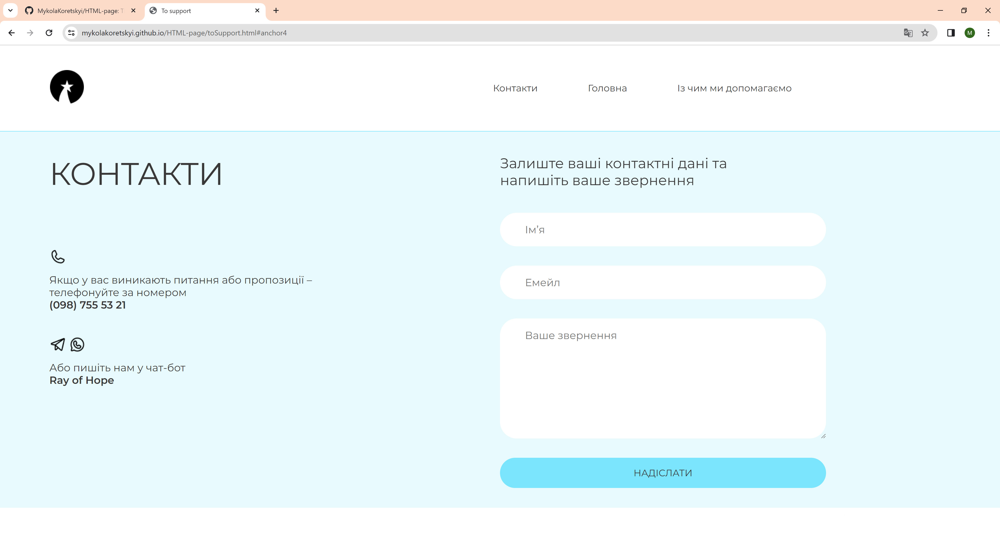

<h1>Website of the charitable foundation</h1>

<h2>Description:</h2>

This is a demo version of a site for a charitable foundation

Link: https://mykolakoretskyi.github.io/HTML-page/

<h2>Technologies Used</h2>

<ul>
<li>HTML</li>
<li>CSS</li>
<li>JavaScript</li>
</ul>

<h2>Screenshots</h2>

<h3>Adaptation of the application for small devices</h3>

